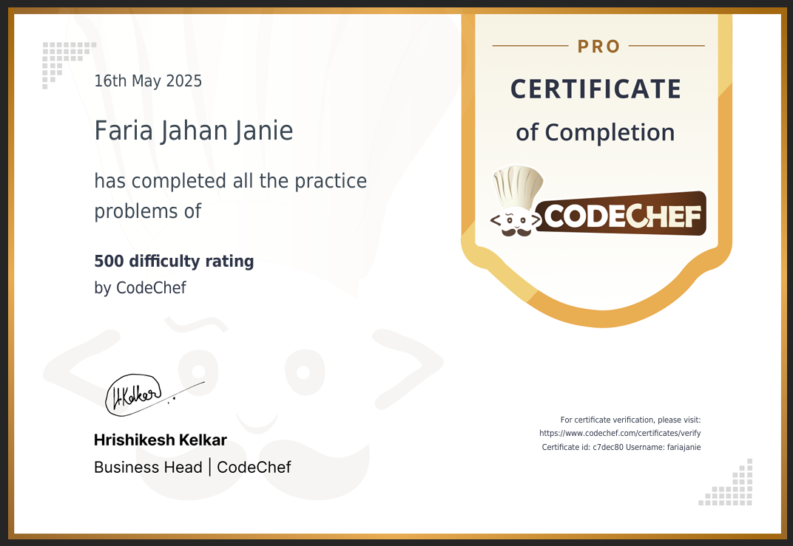

---

## 🏅 CodeChef Achievement: 100–500 Rating Problems

📈 I’ve successfully solved over all ranging from **100 to 500 difficulty level** on [CodeChef](https://www.codechef.com/users/fariajanie).  
📜 I'm proud to have **earned a certificate** from CodeChef for my problem-solving consistency and dedication!

---

### 🛠️ Tools I Use  
- **CodeBlocks** as my primary C++ IDE  
- **C++** programming language for problem-solving  

---
